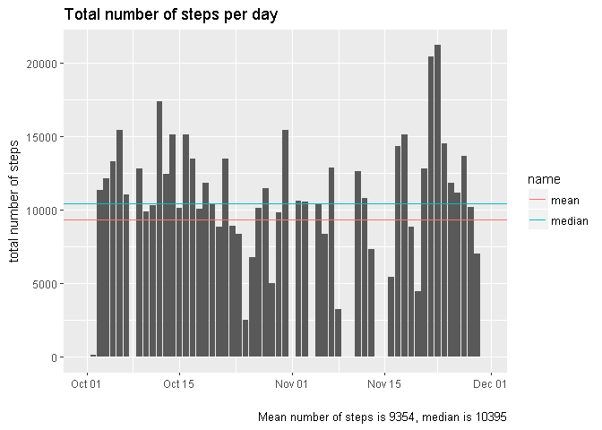
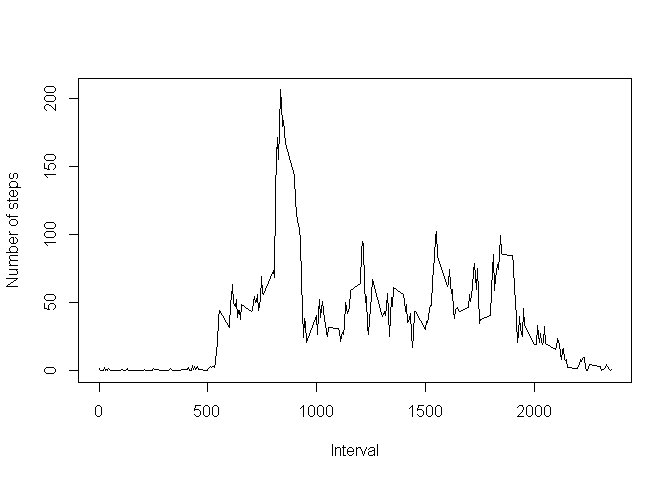
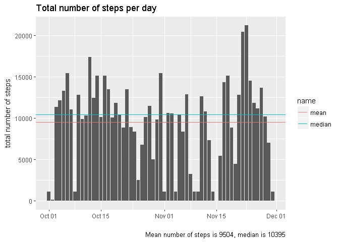
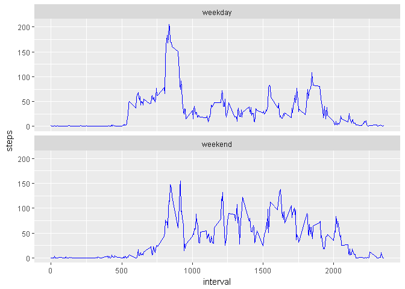

# Reproducible Research: Peer Assessment 1

For reading the data I use the read_csv function in the readr package. This will read the date column as a date directly.

```r
library(readr)
library(ggplot2)
library(dplyr)
```

## Loading and preprocessing the data

This step is straightforward: unzipping and reading the data.

```r
unzip("activity.zip")

activity <- read_csv("activity.csv")
```

```
## Parsed with column specification:
## cols(
##   steps = col_integer(),
##   date = col_date(format = ""),
##   interval = col_integer()
## )
```

## What is mean total number of steps taken per day?

```r
steps_per_day <- activity %>%
  group_by(date) %>%
  summarise(steps = sum(steps, na.rm = TRUE)) 

plot_steps_per_day <- function(steps_per_day) {

  mean <- mean(steps_per_day$steps)
  median <- median(steps_per_day$steps)
  
  # For adding the mean and median to the plot, it is helpful to put them in a dataframe.
  hlines <- data.frame(name = c("mean", "median"), value = c(mean, median))
  
  steps_per_day %>% ggplot() + 
    geom_col(aes(x = date, y = steps)) +
    geom_hline(data = hlines, aes(yintercept = value, color = name)) +
    labs(title = "Total number of steps per day", y = "total number of steps", x = "",
         caption = paste0("Mean number of steps is ", round(mean), ", median is ", median))  
}

plot_steps_per_day(steps_per_day)
```

<!-- -->

## What is the average daily activity pattern?

```r
steps_per_interval <- activity %>%
  group_by(interval) %>%
  summarise(steps = mean(steps, na.rm = TRUE))

plot(steps_per_interval, type = "l", xlab = "Interval", ylab = "Number of steps")
```

<!-- -->


```r
max_number_of_steps <- which.max(steps_per_interval$steps)
```

The 5-minute interval that contains the maximum number of steps (on average across all days) is 104.  

## Imputing missing values

```r
missing <- sapply(activity, function(column) { sum(is.na(column))})

missing
```

```
##    steps     date interval 
##     2304        0        0
```
The date and interval variables are always set. However, for the steps variable, 2304 values are missing.

### Strategy for imputing missing values
The strategy does not need to be sophisticated. Taking the median for that 5-minutes interval seems reasonable. The plot of the average daily activity pattern shows big differences between different times of the day. But common sense suggest that activity may be similar from one day to the next, particularly at night. The median is more robust in case the 5 minutes interval contains outliers.


```r
median_steps_per_interval <- activity %>%
  group_by(interval) %>%
  summarise(median_steps = median(steps, na.rm = TRUE))

activity_imp <- right_join(activity, median_steps_per_interval, by = "interval") %>%
  mutate(steps = ifelse(is.na(steps), median_steps, steps))
```


```r
steps_per_day <- activity_imp %>%
  group_by(date) %>%
  summarise(steps = sum(steps)) 

plot_steps_per_day(steps_per_day)
```

<!-- -->

Compared to the first part of the assignment, the mean has gone up a bit, but the median remained the same. Thus, the impact of imputing value is that the mean increases and probably gets closer to the actual value. The median doesn't change, reflecting the median as a measure is more robust with respect to outliers and missing values.

## Are there differences in activity patterns between weekdays and weekends?

```r
# I have to set the locale, or the weekdays function will return the names of the days in dutch (since I
# am working on a dutch machine).
Sys.setlocale("LC_TIME", "C")
```

```
## [1] "C"
```

```r
day_type <- function(date) {
  as.factor(ifelse(weekdays(date) %in% c("Saturday", "Sunday"), "weekend", "weekday"))
} 

activity_imp <- activity_imp %>%
  mutate(day_type = day_type(date))

activity_imp %>%
  group_by(interval, day_type) %>%
  summarise(steps = mean(steps)) %>%
  ggplot() + geom_line(aes(x = interval, y = steps), color = "blue") + facet_wrap(~day_type, nrow = 2)
```

<!-- -->

